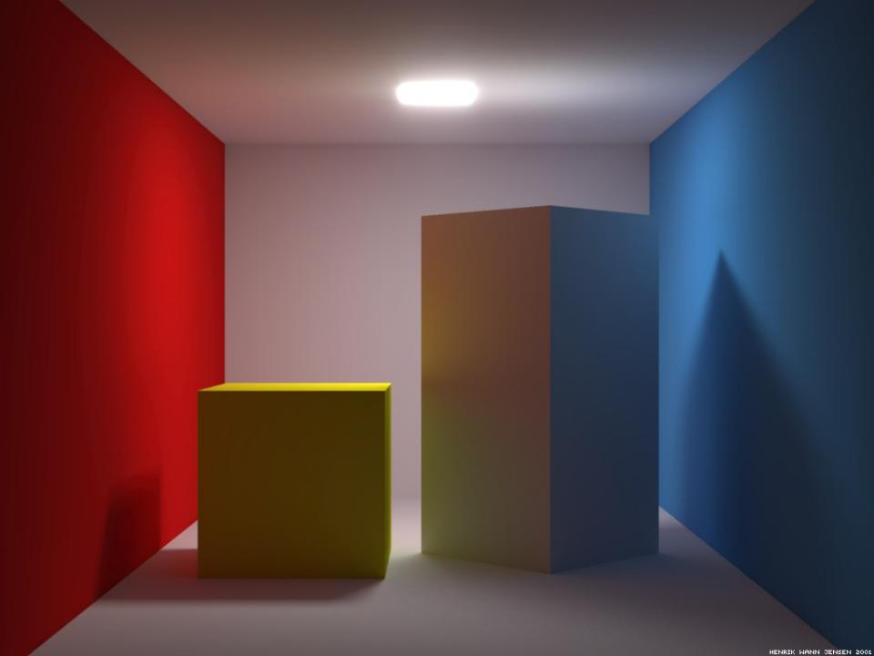
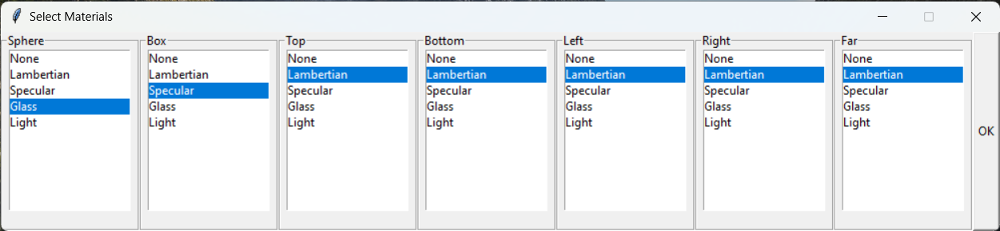
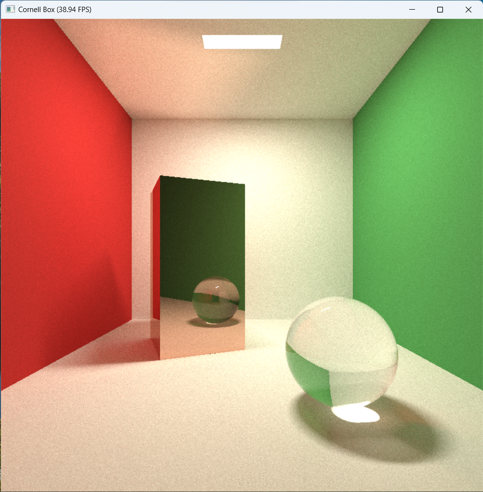

# Индивидуальное задание №2 Корнеллская коробка

*Корнеллская коробка — это тест, направленный на определение точности программного обеспечения для рендеринга путём сравнения визуализированной сцены с реальной фотографией той же самой сцены и является широко используемой тестовой 3D-моделью. Она была создана Синди М. Горал, Кеннетом Э. Торрансом, Дональдом П. Гринбергом и Беннеттом Баттейлом в Корнеллском университете для статьи « Моделирование взаимодействия света между диффузными поверхностями», опубликованной и представленной на выставке SIGGRAPH '84.*



# Задание:
Создать сцену: Корнеллская коробка обязательно в виде большого куба (все грани должны быть). Внутри как минимум 1 объект (не прозрачный и не отражающий. На выбор куб или шар. Один точечный источник света.

* 2-й объект того же вида
* Дополнительный объект другого вида (шар и куб).
* Добавление зеркального отражения для объекта с возможностью включать и выключать зеркальность.
* Добавление прозрачности. С возможностью включать и выключать прозрачность.
* Стена комнаты зеркальная с возможностью выбора стены.
* Добавление дополнительного источника света (положение можно менять).

# Технологии
Задание выполнено при помощи языка программирования Python и jit-компилятора taichi.

*Taichi Lang is an open-source, imperative, parallel programming language for high-performance numerical computation. It is embedded in Python and uses just-in-time (JIT) compiler frameworks, for example LLVM, to offload the compute-intensive Python code to the native GPU or CPU instructions.*

<a href="https://github.com/taichi-dev/taichi/blob/master/python/taichi/examples/simulation/fractal.py#L1-L31"> </a>  

# Особенности реализации
В программе применены материалы из книги [Physically Based Rendering: From Theory To Implementation](https://www.pbr-book.org/3ed-2018/Monte_Carlo_Integration/2D_Sampling_with_Multidimensional_Transformations#CosineSampleHemisphere) за авторством Matt Pharr, Wenzel Jakob, и Greg Humphreys.

``` python
@ti.func
def sample_brdf(normal):
    r, theta = 0.0, 0.0
    sx = ti.random() * 2.0 - 1.0
    sy = ti.random() * 2.0 - 1.0
    if sx != 0 or sy != 0:
        if abs(sx) > abs(sy):
            r = sx
            theta = np.pi / 4 * (sy / sx)
        else:
            r = sy
            theta = np.pi / 4 * (2 - sx / sy)
    # Apply Malley's method to project disk to hemisphere
    u = ti.Vector([1.0, 0.0, 0.0])  # u is tangent vector
    if abs(normal[1]) < 1 - eps:
        u = normal.cross(ti.Vector([0.0, 1.0, 0.0]))
    v = normal.cross(u)  # v is bitangent vector
    costt, sintt = ti.cos(theta), ti.sin(theta)
    xy = (u * costt + v * sintt) * r  # sample on disk
    zlen = ti.sqrt(ti.max(0.0, 1.0 - xy.dot(xy)))
    return xy + zlen * normal  # sample on hemisphere

```

# Скриншоты приложения:
Окно выбора материалов объектов


Окно с рендером сцены

